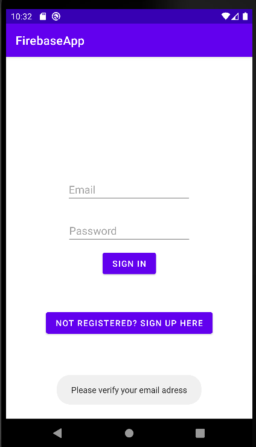
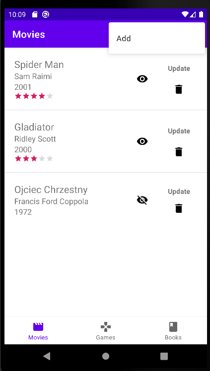
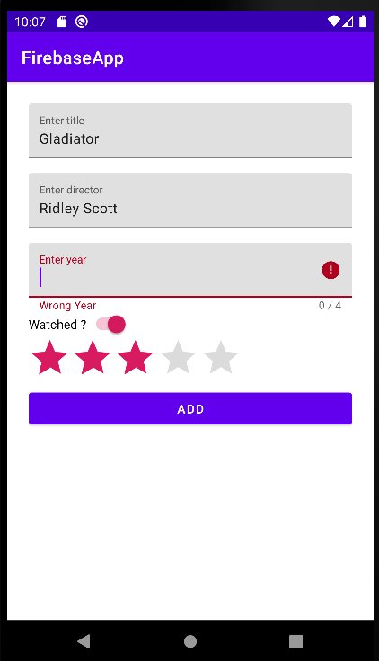
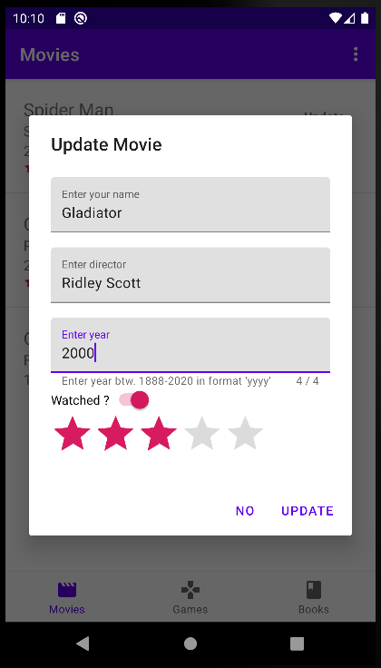
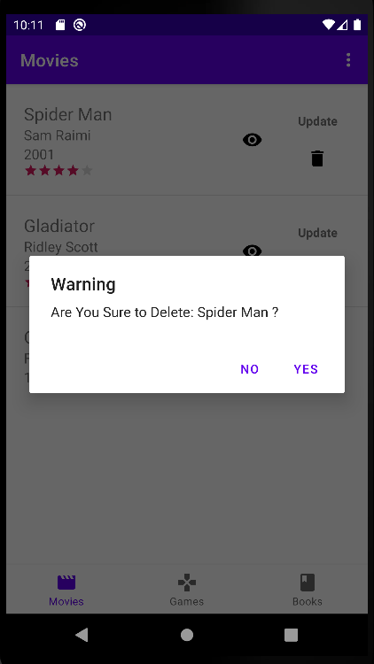

# media-vault

`media-vault` is an android mobile app that provides functionality of storing and rating favorite movies, games and books. App was developed in the `Android Studio` environment using the `Kotlin` programming language. `Firebase` platform and its `Realtime Database` service was used as backend and data storage for the app. User interface was designed using the `Material Design` library.
  

# Views & Features

Authentication was implemented with the use of `Firebase Authentication` service. It provides functionality of user registration by `Email/Password` method. After registration, the user is obligated to verify his email address in order to login to the app. 

Basic data validation was added to the input fields across the application. Functionalities for movies, games and books are the same. `Bottom navigation menu` was implemented in order to navigate through movies, games and books fragments.

sign up view:
---

sign in view:
---

movie collection view:
---

create movie view:
---

update movie view:
---

delete movie:
---

